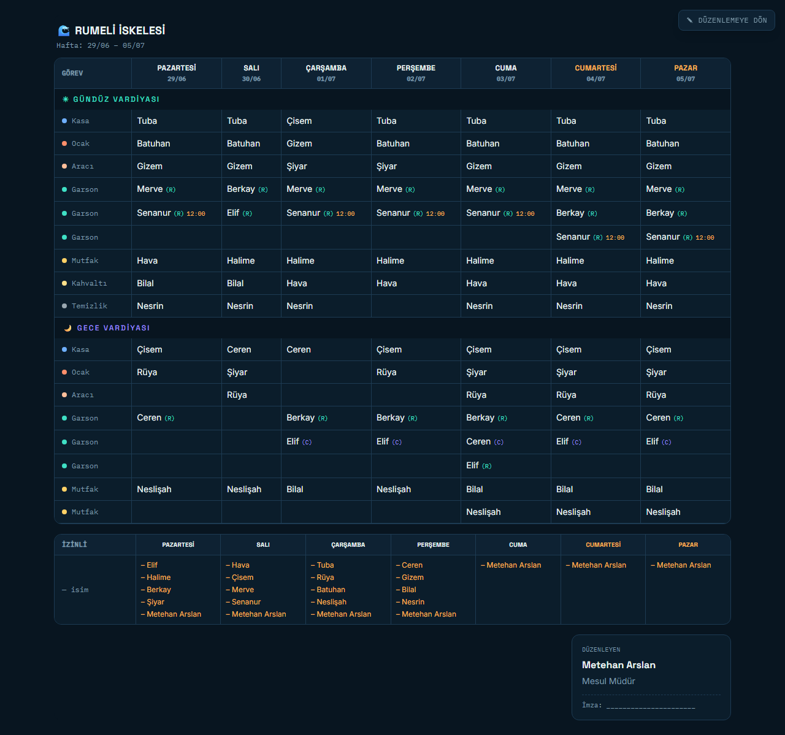
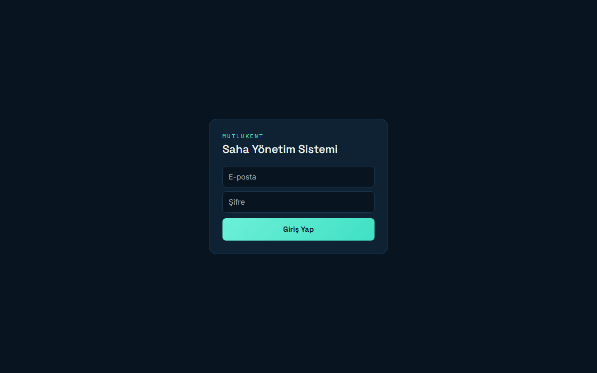
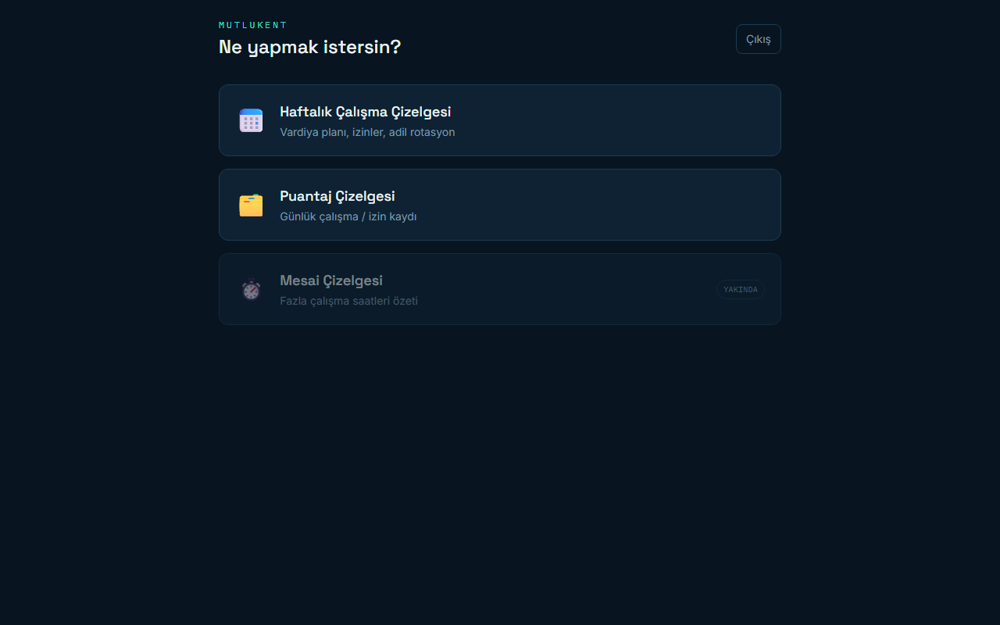
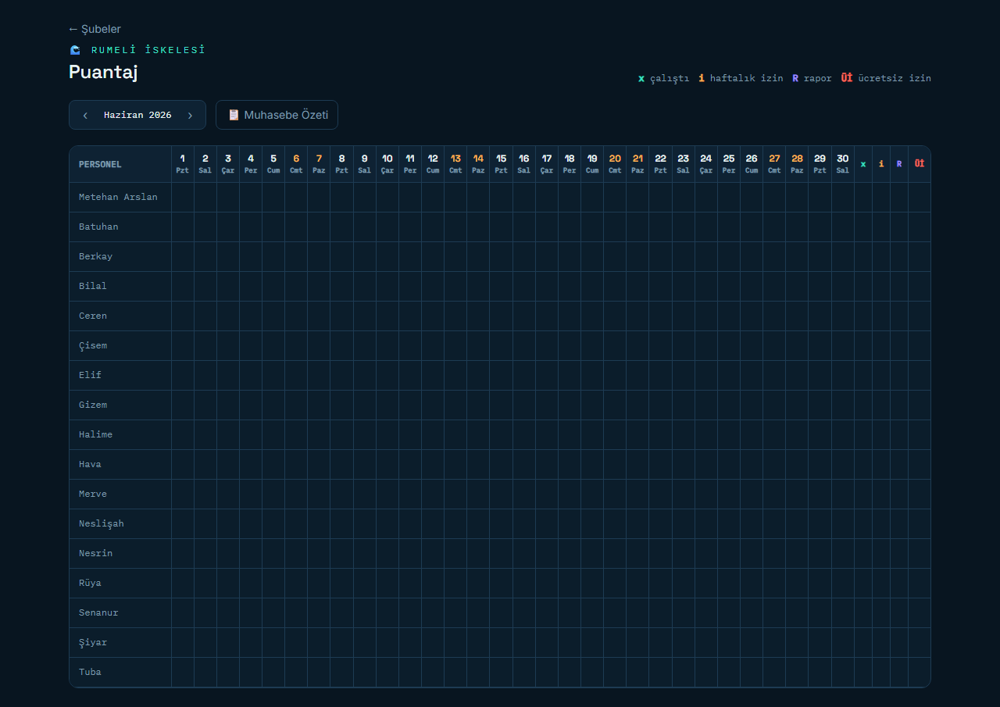

<div align="center">

# 🌊 Mutlukent Saha Yönetim Sistemi

**Çok şubeli işletmeler için çalışma çizelgesi · puantaj · mesai yönetim platformu**

Şube mesul müdürlerinin kağıt üzerinde yürüttüğü haftalık vardiya planlamasını, puantaj takibini ve mesai kayıtlarını
tek bir dijital, mobil öncelikli arayüzde toplar.

[](https://react.dev)
[](https://vitejs.dev)
[](https://tailwindcss.com)
[](https://supabase.com)
[](https://vercel.com)
[]()

</div>

<br>

<div align="center">
  
</div>

<br>

## 📋 İçindekiler

- [Vizyon](#-vizyon)
- [Özellikler](#-özellikler)
- [Ekran Görüntüleri](#-ekran-görüntüleri)
- [Teknoloji Yığını](#-teknoloji-yığını)
- [Proje Yapısı](#-proje-yapısı)
- [Kurulum](#-kurulum)
- [Veritabanı](#-veritabanı)
- [Yol Haritası](#-yol-haritası)
- [Tasarım Sistemi](#-tasarım-sistemi)

---

## 🎯 Vizyon

Şube mesul müdürleri ve işletme müdürlerinin **çalışma çizelgesi**, **puantaj** ve **mesai** işlerini kağıttan
dijitale taşıyan, tek uygulamada toplayan bir yönetim aracı. Her sorumlu kendi şubesini kolayca yönetir; merkez
(işletme müdürü) bağlı tüm şubeleri tek yerden görür.

| Kullanıcı | Yetki |
|---|---|
| **Şube Mesul Müdürü** | Kendi şubesinin çizelgesini kurar, üretir, puantajını işler, paylaşır |
| **İşletme Müdürü / Merkez** | Birden çok şubeyi tek panelden görür ve denetler |

Lokasyon → alt şube hiyerarşisi ile çalışır: her **lokasyon** (Rumeli İskelesi, Sahil, Vagon, Tunaboyu, Millet
Bahçesi, Yahya Kemal) kendi alt işletme birimlerini (dondurma, balık ekmek, pub vb.) barındırır. Şubeler kapanabilir,
sorumlular değişebilir — sistem bunu birinci sınıf bir durum olarak modeller.

## ✨ Özellikler

### 📅 Haftalık Çalışma Çizelgesi — *Faz 1, tamamlandı*

- **Dinamik grid** — şubenin vardiya modeline (tek/çift), R/C (Restoran/Cafe) ve ara vardiya ayarlarına göre kendini kurar
- **Rol bazlı atama** — her slot sadece o görevi yapabilen aktif personeli listeler; sabit izin günü ve aynı gün çift atama otomatik engellenir
- **⚓ Adil Planla** — saf fonksiyon tabanlı adalet/rotasyon motoru (`engine.js`): uzman/yedek önceliği, mutfak haftalık döngüsü, garson sabahçı/ara rotasyonu, gündüz/gece dengesi
- **Hafta bazlı kaydet/yükle** — geçmiş haftalar arşivi, rotasyon sayaçları her ilk kayıtta ilerler
- **⚙️ Şube Ayarları** — görev, personel (çoklu görev + sabit izin), ve haftalık yapı (vardiya × görev slot sayısı) tek ekrandan yönetilir
- **Çıktılar** — Temiz Görünüm, PNG indirme (`html2canvas`), kopyalanabilir WhatsApp metni, yazdır/PDF

### 🗂️ Puantaj — *Faz 2, tamamlandı*

- Aylık grid: personel × gün, tek tıkla **x** (çalıştı) / **i** (haftalık izin) / **R** (rapor) / **Üİ** (ücretsiz izin) döngüsü
- Şube sorumlusu dahil tüm personeli kapsar
- Kişi başı aylık toplamlar + muhasebeye gönderilecek WhatsApp özet metni

### ⏱️ Mesai — *Faz 3, planlanıyor*

Günlük fazla çalışma (+saat) kaydı, aylık özet, muhasebe çıktısı.

### 🏢 Merkez Panel — *Faz 4, planlanıyor*

İşletme müdürü için çok şubeyi tek bakışta gösteren, eksik kapsama/çakışma uyarılı denetim ekranı.

## 🖼️ Ekran Görüntüleri

<table>
<tr>
<td width="50%">

**Giriş**


</td>
<td width="50%">

**Modül Seçimi**


</td>
</tr>
<tr>
<td width="50%" colspan="2">

**Puantaj**


</td>
</tr>
</table>

## 🛠️ Teknoloji Yığını

| Katman | Teknoloji |
|---|---|
| Frontend | React 18 + Vite 5 + React Router 6 |
| Stil | Tailwind CSS 3 — koyu deniz teması, mobil öncelikli |
| Backend | Supabase (Postgres + Auth + Row Level Security) |
| Çıktılar | html2canvas (PNG), tarayıcı yazdırma (PDF) |
| Dağıtım | Vercel |

## 📁 Proje Yapısı

```
src/
  lib/supabase.js              # Supabase istemcisi
  context/AuthContext.jsx      # Oturum yönetimi
  pages/
    Login.jsx                  # Giriş
    ModulSecimi.jsx             # Çizelge / Puantaj / Mesai modül seçimi
    SubeSecimi.jsx              # Modüle göre şube seçimi (lokasyon → alt şube)
  modules/
    cizelge/
      CizelgePage.jsx           # Haftalık çizelge ekranı
      SubeAyarlari.jsx          # Görev / personel / yapı yönetimi
      engine.js                 # Adalet/rotasyon motoru (saf fonksiyon)
    puantaj/
      PuantajPage.jsx           # Aylık puantaj grid'i

docs/
  00-08_*.md                    # Bağlayıcı proje dokümanları (vizyon, kurallar, veri modeli…)
  supabase_schema.sql            # Ana şema (tablolar + RLS + şube tohumu)
  migration_puantaj.sql          # Puantaj tablosu migration'ı
  reference/                     # Çalışan HTML referans prototipi
  screenshots/                   # Bu README'deki görseller
```

## 🚀 Kurulum

```bash
npm install
cp .env.example .env     # Supabase Project URL + anon key'i doldur
npm run dev
```

### Supabase Kurulumu

1. [supabase.com](https://supabase.com)'da yeni proje aç.
2. SQL Editor'da sırasıyla çalıştır:
   - `docs/supabase_schema.sql` — ana tablolar + RLS + şube tohumu
   - `docs/migration_puantaj.sql` — puantaj modülü
3. Project Settings → API'den **Project URL** ve **anon key**'i `.env`'e yaz.
4. Authentication → Users'tan kendine bir hesap oluştur.
5. SQL Editor'da kendini şubene bağla:
   ```sql
   insert into kullanici_subeleri(user_id, sube_id, rol)
   select auth.uid(), id, 'sorumlu' from subeler where ad = 'Rumeli İskelesi';
   ```
   Alt şubelere erişim otomatik miras kalır.

### Vercel'e Dağıtım

1. Repoyu GitHub'a push et.
2. Vercel → "Import Project" → bu repo.
3. Environment Variables: `VITE_SUPABASE_URL`, `VITE_SUPABASE_ANON_KEY`.
4. Deploy.

## 🗄️ Veritabanı

Lokasyon → alt şube hiyerarşisi, satır düzeyi güvenlik (RLS) ile korunur. `has_sube(sube_id)` yardımcı fonksiyonu,
bir kullanıcının bağlı olduğu şubeyi **ve tüm alt şubelerini** otomatik kapsar — sorumlu yalnız kendi lokasyonuna
bağlanır, alt şube erişimi miras kalır.

| Tablo | Amaç |
|---|---|
| `subeler` | Şube + hiyerarşi (`ust_sube_id`) + vardiya modeli + opsiyonel özellikler |
| `kullanici_subeleri` | Kullanıcı ↔ şube yetkisi |
| `gorevler` | Şubeye özel görevler |
| `personel` | Ad, sabit izin günü, aktiflik |
| `personel_gorevleri` | Çoklu görev bağlantısı (n-n) |
| `yapi` | Vardiya başına görev slot sayısı |
| `cizelge` / `cizelge_atamalari` | Haftalık çizelge + atamalar |
| `rotasyon_sayaclari` | Adalet motoru hafızası |
| `puantaj` | Günlük çalışma/izin kaydı (x/i/R/Üİ) |

## 🗺️ Yol Haritası

| Faz | Modül | Durum |
|---|---|---|
| 1 | Haftalık Çalışma Çizelgesi | ✅ Tamamlandı |
| 2 | Puantaj | ✅ Tamamlandı |
| 3 | Mesai | 🔜 Planlanıyor |
| 4 | Merkez Panel (çok şube) | 🔜 Planlanıyor |

Detaylı kararlar ve kurallar için `docs/` klasörüne bakın — özellikle `03_Cizelge_Kurallari.md` (adalet motoru
mantığı) ve `05_Veri_Modeli.md` (şema kararları) bağlayıcıdır.

## 🎨 Tasarım Sistemi

Koyu deniz teması — mobil öncelikli, yatay kaydırmalı tablolar:

| Renk | Kullanım |
|---|---|
| `#081520` `#0e2233` | Arka plan / panel (sea-900 / sea-800) |
| `#3fe0c5` **foam** | Birincil vurgu, başarı durumu |
| `#9d8bff` **violet** | İkincil vurgu (gece vardiyası, Cafe) |
| `#ffb454` **amber** | Uyarı, hafta sonu, izin |
| `#ff6b5c` **coral** | Hata, ücretsiz izin |

Font: **Space Grotesk** (başlık) · **Inter** (gövde) · **IBM Plex Mono** (sayı/çıktı)

---

<div align="center">

Mutlukent için geliştirildi 🌊

</div>
